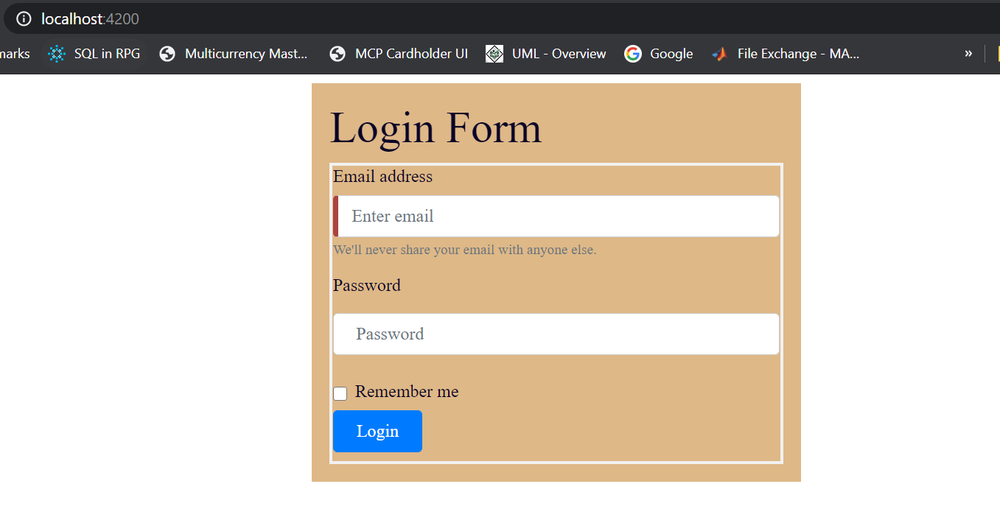
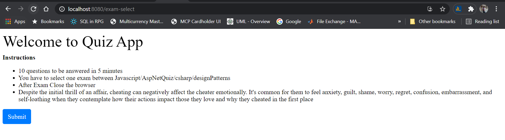
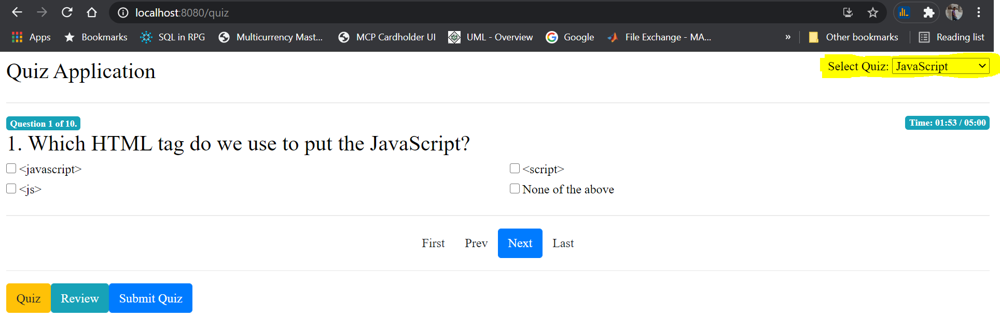
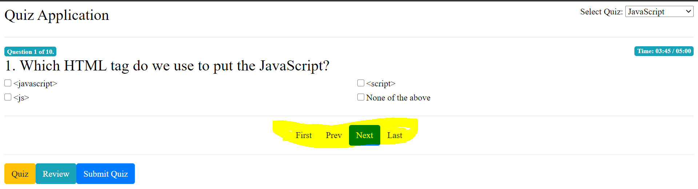
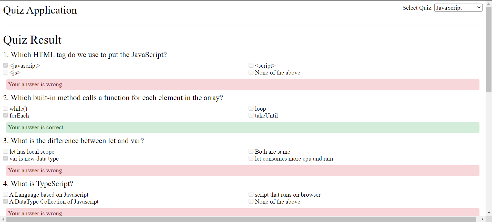
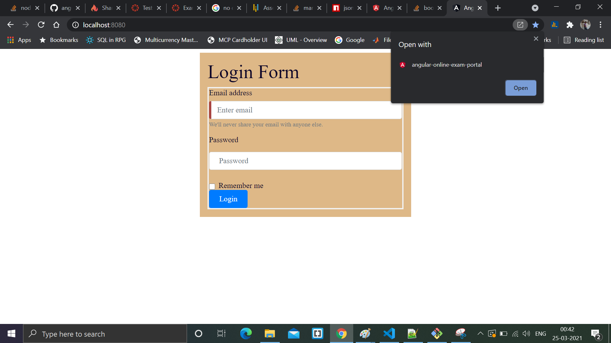
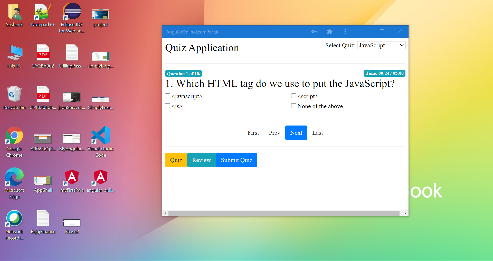

# Online Test Application {#readme_start_page}

To see what is in latest release , see [CHANGELOG](CHANGELOG.md)

#### Pre-requisite

* JSON install `npm install -g json-server`
* Start JSON server `json-server --watch src/data/all-questions.json`

#### Setup 

* Checkout porject into your local folder.
* Open using Visual Studio Code.
* PWA enabled , hence can be installed as a application.
* Build project by using `ng build --prod`.
* Start project by using `http-server -p 8080 -c-1 dist/angular-online-exam-portal`

#### Workflow 

* In browser post `http://localhost:8080/`

* On browser Login to application using email "sashanka.singh@gmail.com" and password "sashanka1985".
* On next page click Submit.

* You will land on quiz page where you can select quizes on the top left

* Answer questions.
* You can go to First/Prev/Next/Last question.

* After time expires/or after you press Submit Quiz, you go to the review page.

#### Extra
* App Installed.

* Online portal as Application.

* Offline access.

